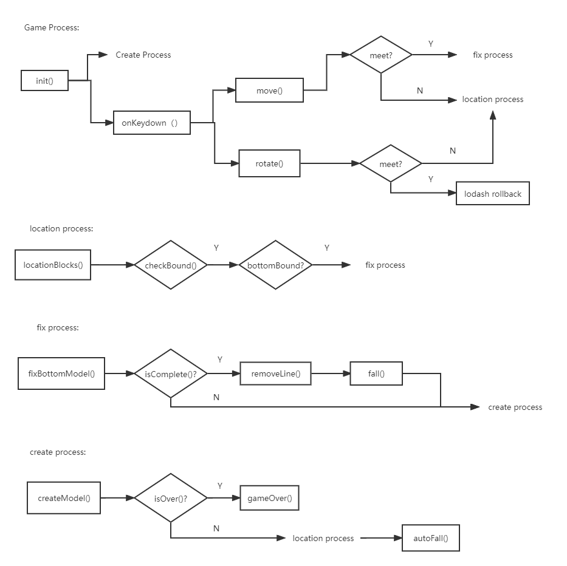

# 俄罗斯方块游戏设计说明

## 1  游戏规则

按键盘左右键控制滑落的而俄罗斯方块左右移动
按键盘上键顺时针旋转俄罗斯方块90°
铺满任意一行会自动消除该行并且积1分
在俄罗斯方块触顶时游戏结束并显示分数

## 2  启动

UI通过html实现，为了方便逻辑的开发，所以采用js操纵html中的DOM对象。在与游戏引擎对接时应该修改掉所有的操作方式。

## 3  main.js接口描述

### 3.1  常量

```js
const STEP = 40
const WIDTH = 400
const HEIGHT = 720
const ROW = HEIGHT / STEP
const COL = WIDTH / STEP
var scores = 0;
var MODELS = [...]
var curModel = {}
var curX = 0, curY = 0
var fixedBlocks = {}
var mInterval = null
```

在上述常量中，`STEP`描述每个模块的一个方块的边长（也就是背景的单位长度、模块一次移动的步长）；`WIDTH, HEIGHT`分别是背景容器的宽与高；并根据长宽和单位长度计算出行数以及列数`ROW, COL`；`scores`用来记录玩家当前这局游戏获得了多少分数；`MODELS`是一个列表，列表的每一个元素是不同的俄罗斯方块模型，我们的游戏里包括的模型有L型、凸型、田型、一型、Z型，由于这些模型的大小都不超过4*4单位的16宫格，所以在最初定位以及后面的移动旋转时我们都是基于16宫格的基础上进行操作的，如果后面的模型有所变动那么应该增大基础宫格；`curModel`赋值为当前使用的那个形状的模型，也就是`MODELS[random_int]`，同时它还负责记录当前模块在16宫格中被旋转的相对位置（通过修改原有的值）；`curX, curY`记录当前模块的16宫格在整个容器里的偏移量，X描述横向、Y描述纵向；`fixedBlocks`是一个JSON格式的对象，键是`row_col`，值为当前的固定的块或null，null代表没有块，用来记录所有已经被固定的块；`mInterval`是用来控制俄罗斯方块自动下落的计时器

### 3.2  第三方库

```js
var  JSElement=document.createElement("script");
JSElement.setAttribute("type","text/javascript");
JSElement.setAttribute("src","lodash.min.js");
document.body.appendChild(JSElement);
```

由于没有找到支持ES6的lodash版本，所以使用了老版本的lodash并用了这样的方式引入到main.js里。在后面修改时应该找到高版本的lodash使用`import _ from 'lodash.min.js'`来引入`_`变量。在本次开发中，我们使用了lodash的深拷贝（在`function rotate(){}`中），如果不想使用lodash的话可以自己实现深拷贝进行替换；lodash随机数可以用Math的随机数替换（在`createModel()`中）。

### 3.3  方法

```js
function init(){ createModel() onKeyDown() }
function onKeyDown(){...}
function move(x, y){}
function rotate(){}    // lodash
function createModel(){}    // lodash
function locationBlocks(){}
function checkBound(){}
function fixBottomModel(){}
function meet(x, y, model){}
function isComplete(){}
function removeLine(rowNo){}
function fall(rowNo){}
function autoFall(){}
function isOver(){}
function gameOver(){}
```

`init()`方法是main.js的入口，在html页面加载成功时被调用，在init方法中调用`createModel()`创建初始模块，并调用`onKeyDown()`监听键盘按键事件。`onKeyDown()`监听到键盘事件后调用对应的`move()`或`rotate()`方法操作俄罗斯方块，在这两个方法中都要调用`meet()`方法判断是否与已经固定的俄罗斯方块碰撞，`meet()`接收三个参数，分别是将要移动到的X位置、Y位置、将要旋转到的模型，如果不发生碰撞调用`locationBlocks()`移动俄罗斯方块的位置。再回头看`createModel()`方法，在该方法里我们调用`isOver()`方法判断游戏是否结束，如果结束调用`gameOver()`结束游戏并返回，否则创建新的模块定位并调用`autoFall()`使其自动降落。在定位方法`locationBlocks()`中，定位之前要检擦边界`checkBound()`保证模块只在容器内部活动，当模块触底或者底部触碰到已固定模块时调用`fixBottomModel()`增加该模块为固定模块。`fixBottomModel()`每次固定后都要检查`isComplete()`是否有任何一行被铺满，如果被铺满就内置地调用`removeLine(rowNo)`清除该行并积分再内置调用`fall()`使上面的行掉落，然后继续`createModel()`.

### 3.4  与html紧耦合

#### 3.4.1  js常量

所有的常量都与html是紧耦合的，因为现在的游戏是基于html.div操作子div的偏移量（像素）来实现的，所有数值描述的都是多少单位的像素。

#### 3.4.2  js方法

1.`function onKeyDown(){}`使用`document.onkeydown`监听事件，并且用`event.key`获取键盘值
2.`function createModel(){}`使用以下语句创建一个新的俄罗斯方块

```js
function createModel(){
    for(let key in curModel) {
        let block = document.createElement("div")
        block.className = "active_block"
        document.getElementById("container").appendChild(block)
    }
}
```

3.`function locationBlocks(){}`使用`document.getElementsByClassName("active_block")`获取当前的俄罗斯方块并修改其属性，使用类名获取DOM或者更改类名的方法还有`function fixBottomModel(){}`
4.`function removeLine(rowNo){}`使用`document.getElementById("container").removeChild(fixedBlocks[rowNo+"_"+i])`获取容器div并删除块

## 4  大致流程图


